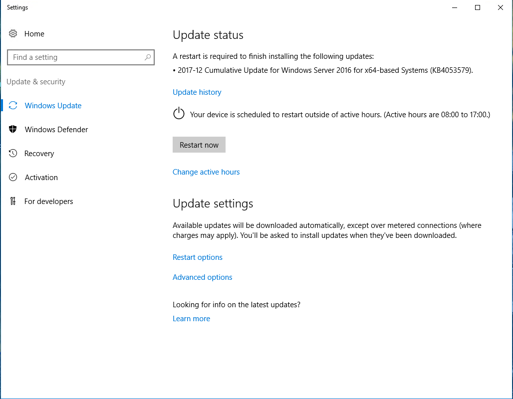
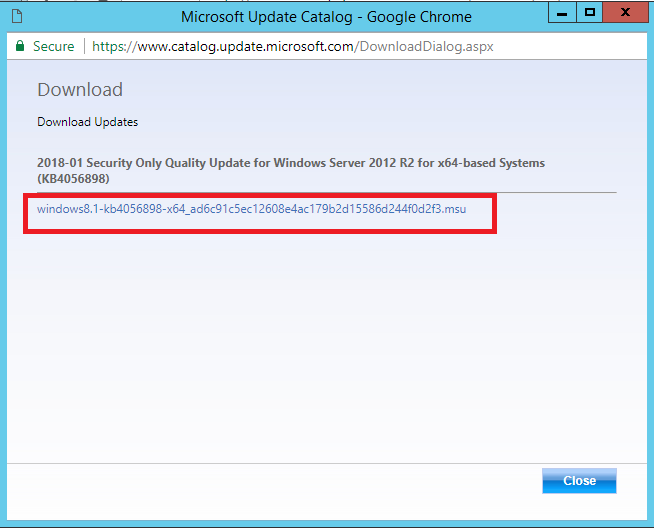

# Protecting against the Meltdown and Spectre Vulnerabilities in Windows

* Microsoft have released a security patch to provide protection against the recently discovered vulnerabilities in a large number of CPU chipsets.

These updates will be pushed out through the regular Windows Update channels. You can checking for any outstanding Windows updates using the steps below:

## Applying Windows Updates on Server 2008 R2

In Windows server 2008 R2, Click on Start and type the "Windows Update" to search for the Windows Update utility.


In Windows Updates, you can click on the "Check for Updates" option on the left hand menu to check for any newly released updates


## Applying Windows Updates on Server 2012 R2

In Windows Server 2012 R2, Click on Start, and type "updates", and then click on Windows Updates:


You can now select the "Check for Updates" button on the left, which will perform an check for any newly released Windows Updates:


## Applying Windows Updates on Server 2016

In Windows Server 2016, Click on Start, and type "Windows Update" in the search bar:


Click on "Windows Update Settings", and from here you can check for any new updates:



## Manual Installation

The patches for Windows Server 2008R2, 2012R2 and 2016 can be downloaded directly from the Microsoft Update Catalog. These links are provided below:

* Microsoft Server 2016
https://www.catalog.update.microsoft.com/Search.aspx?q=KB4056890

* Microsoft Server 2012 R2
https://www.catalog.update.microsoft.com/Search.aspx?q=KB4056898

* Microsoft Server 2008 R2
https://www.catalog.update.microsoft.com/Search.aspx?q=KB4056897


The basic walkthrough for manually installing the patch is provided below:
(This will be performed on Server 2012 R2, however for manual installation, the steps will be similar for the other Windows Server editions above)

* Follow the above link for your specific operating system and click `Download` on the patch relevant to your operating system.


* This will download the patch to your downloads folder by default. You can then browse to your download location and click to install the patch.




* Run through the installation, and when complete, you will be asked to reboot your machine. You will need to reboot your machine for the patch to take effect.


# Enable the Registry keys
* Once the patch has been applied and the updates have been installed, you will need to add 2 registry keys to enable the mitigations on the server. This is per the Microsoft documentation linked at the bottom of this page.

You can open up an administrator `CMD Prompt` and run the following 2 commands, one after another. This will add the relevant registry keys. If you are not comfortable making these changes then please seek assistance from the from the support team.
```
reg add "HKEY_LOCAL_MACHINE\SYSTEM\CurrentControlSet\Control\Session Manager\Memory Management" /v FeatureSettingsOverride /t REG_DWORD /d 0 /f

reg add "HKEY_LOCAL_MACHINE\SYSTEM\CurrentControlSet\Control\Session Manager\Memory Management" /v FeatureSettingsOverrideMask /t REG_DWORD /d 3 /f
```

For further information, please refer to the Microsoft documentation, provided below:
https://support.microsoft.com/en-us/help/4072698/windows-server-guidance-to-protect-against-the-speculative-execution-s

```eval_rst
  .. meta::
     :title: Meltdown and Spectre patch for Windows | UKFast Documentation
     :description: A guide to patching against recent CPU vulnerabilities
     :keywords: ukfast, windows, security, updates, meltdown, spectre, cpu, tutorial, guide
